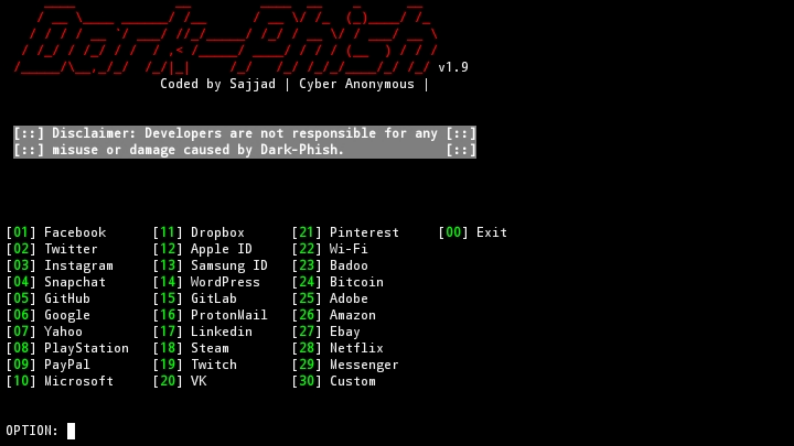

<h2>Dark-Phish</h2>
Empowering Ethical Phishing for Security Assessment.

<p align="center">


<h1 align="center"> Dark-Phish v2.1</h1>

**Dark-Phish** is a specialized phishing tool created for educational and security testing purposes. It provides users with the capability to simulate phishing attacks, enabling the assessment of system vulnerabilities and user awareness.


## Features

- **Multiple Tunneling Options**: Choose from various methods for flexible phishing simulation.

- **Auto-saved Credentials**: Victim credentials are stored automatically.

- **Credential Management**: Easily access and manage saved credentials.

- **Custom Phishing Templates**: Create customized and convincing phishing scenarios.

- **OTP Capture**: Efficiently collect one-time passwords for improved assessment capabilities.

- **URL Obfuscation:** Dark-Phish conceals phishing URLs, making them appear trustworthy and less suspicious.


## Tested on
- Kali Linux
- Termux

## Installation

```bash
apt install python3 curl php git openssh -y
```
```bash
pip3 install requests wget pyshorteners
```
```bash
git clone https://github.com/Cyber-Anonymous/Dark-Phish.git
cd Dark-Phish
```

## Usage 
*Before using Dark-Phish, ensure you have the necessary packages installed as mentioned in the installation section.*

- Run Dark-Phish
```bash
python3 dark-phish.py
```
- For help and usage information
```bash
python3 dark-phish.py -h
```
- To access saved credentials
```bash
python3 dark-phish.py -r
```

## OTP Capture Technique

 1. When a victim enters their credentials on the phishing page, the attacker immediately receives this information.
 2. The attacker, using the victim's credentials, logs into the legitimate website.
 3. The genuine website sends an actual OTP to the victim.
 4. Believing it's legitimate, the victim enters the OTP on the phishing page.
 5. The attacker intercepts the OTP, gaining access to the victim's credentials and logging in first.


## Available tunnels
1. Localhost
2. Ngrok
3. Cloudflared 
4. LocalXpose 
5. Serveo

## Dark-Phish


## Thanks to TheLinuxChoice

## Disclaimer 
***Dark-Phish is intended for educational and testing purposes only. Any use of this tool for illegal or unethical activities is strictly prohibited. The authors and contributors are not responsible for any misuse or damage caused by Dark-Phish. Use it responsibly and ensure compliance with all applicable laws and regulations in your jurisdiction.***