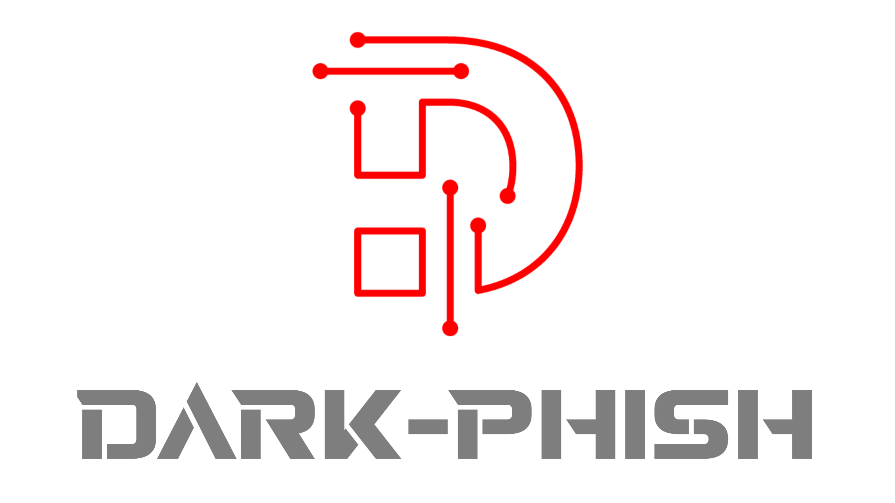
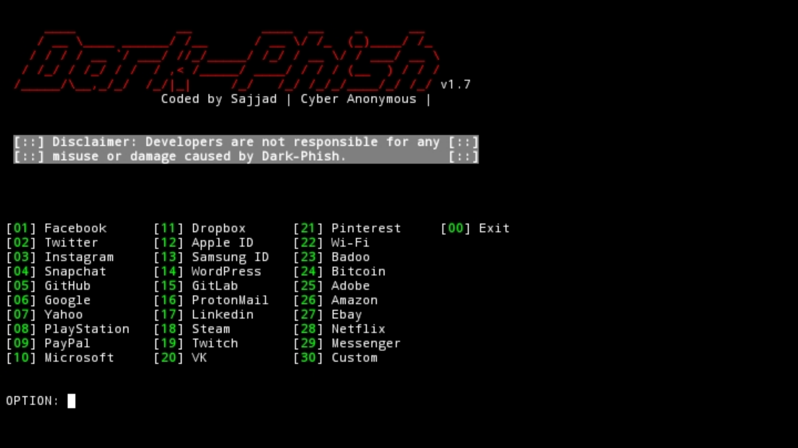

  

<h1 align="center"> Dark-Phish v1.7</h1>

# Tested on
- Kali Linux
- Termux

# Installation

* apt install python3

* apt install curl

* apt install php

* apt install git

* git clone https://github.com/Cyber-Anonymous/Dark-Phish.git

* pip3 install requests

* pip3 install wget

* cd Dark-Phish

* python3 dark-phish.py

## Dark-Phish

# Thanks to TheLinuxChoice

# Warning
***This tool is only for educational purpose. We are not responsible for any misuse or illegal activities.***
